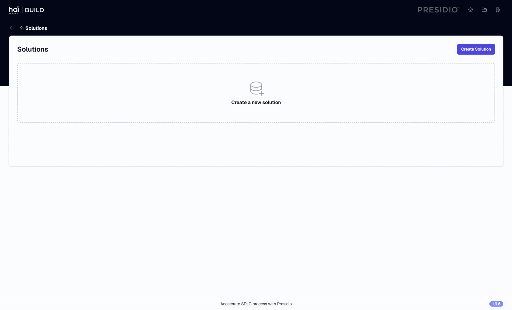
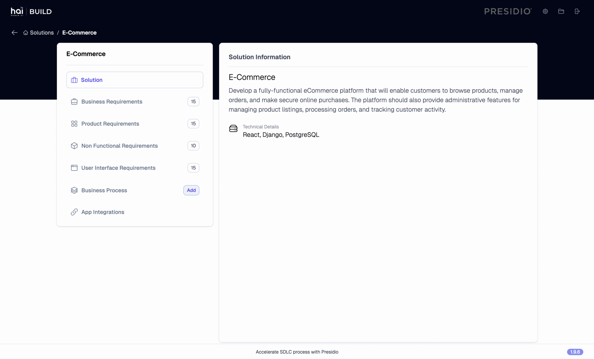
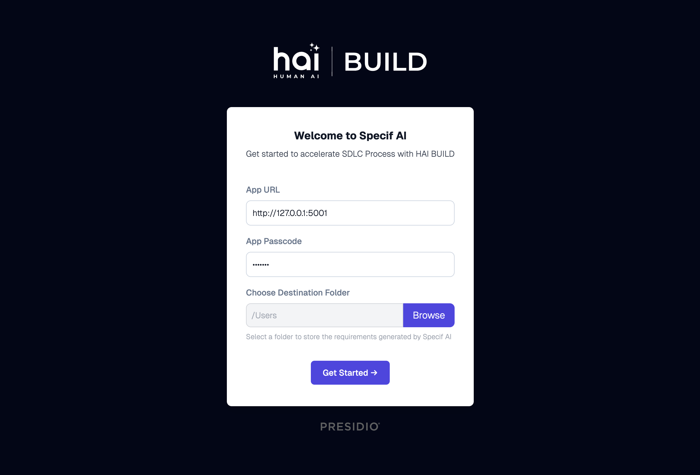
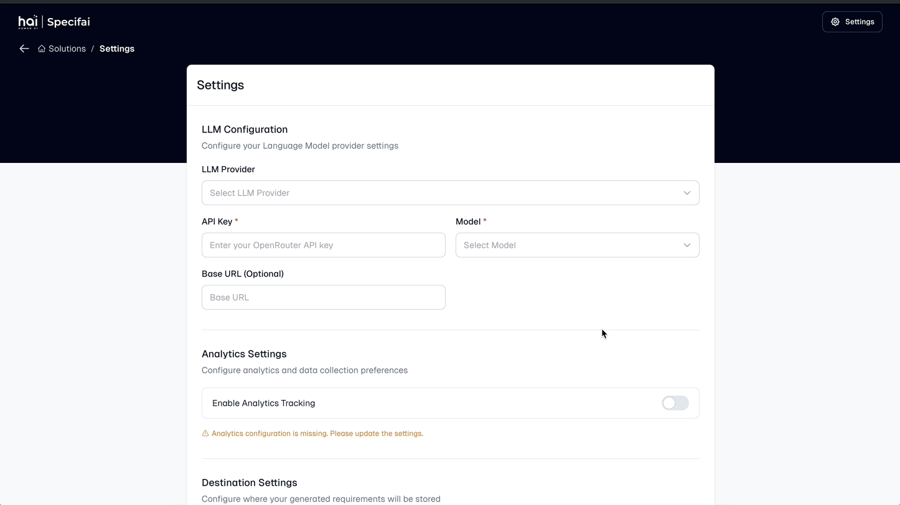
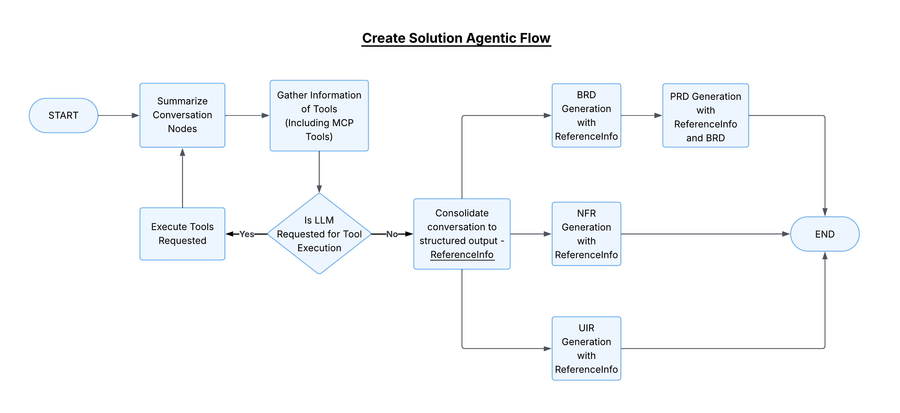
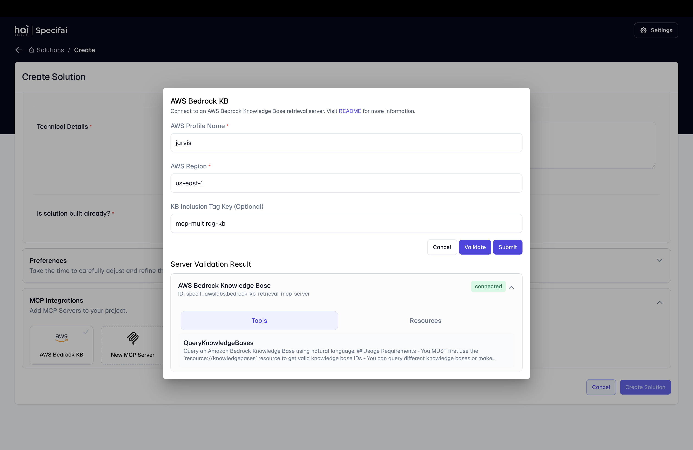
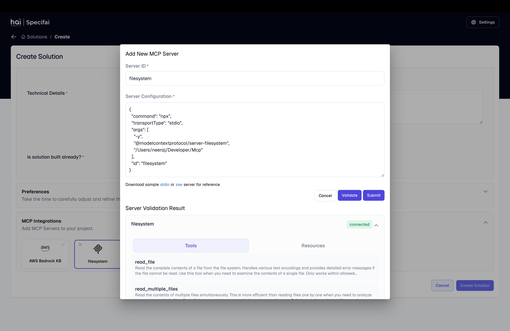
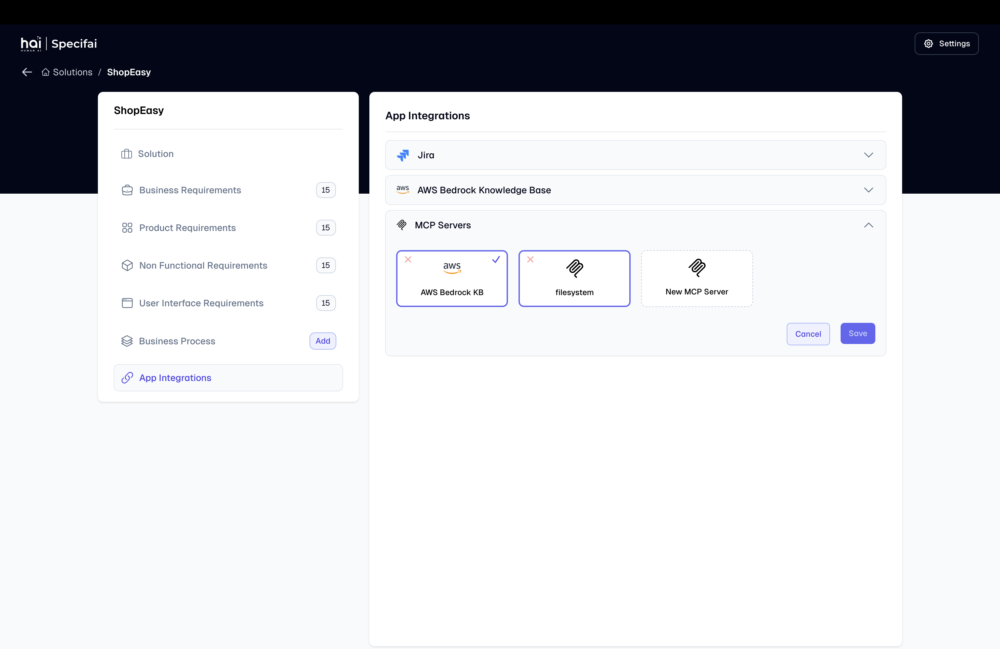
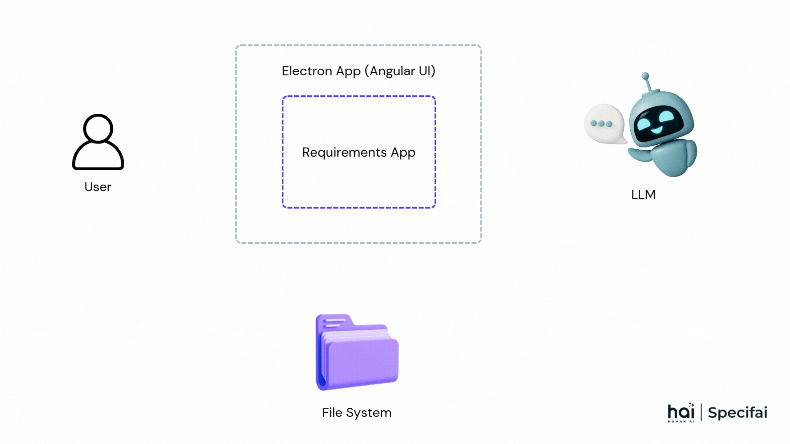

<div align="center">
  
  
  
  
</div>
<br />
<div align="center">
  <picture>
    <source media="(prefers-color-scheme: dark)" srcset="assets/img/hai-specif-ai-light.svg">
    <source media="(prefers-color-scheme: light)" srcset="assets/img/hai-specif-ai-theme.svg">
    
  </picture>
</div>
<br />  
<div align="center">
  <em>Accelerate your SDLC process with AI-powered intelligence.<br>
  From ideas to actionable tasks in minutes.</em>
</div>
<br>

# 🚀 Specifai

**Specifai** is an AI-powered platform that transforms the project requirements management. It combines AI technology with intuitive workflows to automate documentation, generate and manage tasks - all while adapting to your team's specific needs.
<div align="center">
    
</div>

## Table of Contents
- [🌟 Overview](#overview)
- [📥 Getting Started](#getting-started)
- [✨ Key Features](#key-features)
   - [🔌 Integrations](#integrations)
- [🏗 Architecture](#architecture)
- [📝 Version-Controlled Requirements Management](#version-controlled-requirements-management)
- [🗺 Roadmap](#roadmap)
- [🤝 Contributing](#contributing)
- [📜 License](#license)
- [📧 Contact](#-contact)

## 🌟 Overview

In today's fast-paced software development landscape, delivering high-quality solutions quickly is more critical than ever. Specifai is a cutting-edge platform that revolutionizes how teams generate, manage, and refine software requirements by combining AI intelligence with human context.

By simply providing a solution name, description, and tech stack details, Specifai automatically generates comprehensive documentation, including:

- 📄 Business Requirement Documents (BRD)
- 🔧 Non-Functional Requirements Documents (NFRD)
- 📱 Product Requirement Documents (PRD)
- 🎨 User Interface Requirements (UIR)
- 🔄 Business Process Flows

<div align="center">
    
</div>

## 📥 Getting Started



1. **Download the Specifai desktop application** from the [releases page](https://github.com/presidio-oss/specif-ai/releases).
2. **Start** the Desktop Application
3. **Enter the Username and Working directory and get started!**

### 🧩 For Developers
1. **Clone the repository**
   ```bash
   git clone https://github.com/presidio-oss/specif-ai.git
   cd specif-ai
   ```
2. **Set up the development environment**
   - [Electron Desktop Application Setup](./electron/README.md)
   - [Angular UI Setup](./ui/README.md)

## ✨ Key Features

- **🤖 AI-Powered Document Generation**: Effortlessly create detailed SDLC documentation.
- **💬 Intelligent Chat Interface**: Get real-time requirement edits and context-specific suggestions.

<div align="center">

  
*AI powered chat feature in action*

</div>

- **📊 Business Process Visualization**: Easily generate and manage process flows.
- **📋 User Story Generation**: Convert requirements into actionable user stories and tasks.
- **🔗 Linking BRDs and PRDs**: Share BRD context to PRDs for holistic output.

<div align="center">

  
*User story and task generation*
</div>

- **🔍 Analytics & Observability**: Optional analytics and observability tracked in PostHog and Langfuse.
- **🔄 Multi-Model Support**: Choose the model that best suits your needs. Supported models include:
   - Azure OpenAI
      - gpt-4o
      - gpt-4o-mini
   - OpenAI Native
      - gpt-4o
      - gpt-4o-mini
   - AWS Bedrock
      - anthropic.claude-3-7-sonnet-20250219-v1:0
      - anthropic.claude-3-5-sonnet-20241022-v2:0
      - anthropic.claude-3-5-haiku-20241022-v1:0
      - anthropic.claude-3-5-sonnet-20240620-v1:0
      - anthropic.claude-3-opus-20240229-v1:0
      - anthropic.claude-3-sonnet-20240229-v1:0
      - anthropic.claude-3-haiku-20240307-v1:0
   - Gemini
      - gemini-2.0-flash-001
      - gemini-2.0-flash-lite-preview-02-05
      - gemini-2.0-pro-exp-02-05
      - gemini-2.0-flash-thinking-exp-01-21
      - gemini-2.0-flash-thinking-exp-1219
      - gemini-2.0-flash-exp
      - gemini-1.5-flash-002
      - gemini-1.5-flash-exp-0827
      - gemini-1.5-flash-8b-exp-0827
      - gemini-1.5-pro-002
      - gemini-1.5-pro-exp-0827
      - gemini-exp-1206
   - OpenRouter
   - Ollama

<div align="center">

  
*Easily configurable multi provider support*

</div>

#### ✨ Agentic Solution Requirement Generation Flow

Specif AI utilises the Langgraph framework to deliver an efficient agentic workflow, enhancing the creation of solution requirements with precision. Following are the key phases involved:

- **Context Gathering Phase:** 
  - **Summarisation:** Analyses solution metadata and conversation history, employing summarisation to manage conversation context data effectively.
  - **Context Gathering:** Integrates data from a Knowledge-Base, incorporating adaptable MCP server tools for enhanced flexibility.
  - **Decision Point:** Assesses the need for Large Language Model (LLM) tool execution, iterating until the tool executions phase is complete.
  - **Data Consolidation** Organises data into a structured ReferenceInfo format.
- **Requirement Generation Phase**: The structured output from previous phase drives the creation of Business Requirements Document (BRD), Product Requirements Document (PRD), Non-functional Requirements Document (NFR) and User Interface Requirements (UIR). 

This Agentic architecture ensures seamless task orchestration and accelerates the solution  creation process.

  


### 🔌 Integrations

Specifai seamlessly integrates with popular tools to enhance your workflow:

#### Jira Integration
The stories and tasks generated as part of the solutions can be used to create actual stories and tasks in your Jira instance using the Jira integration provided by the application. Features include:
- Automatic story and task creation in Jira.
- Bulk export capabilities.

For Jira setup instructions, please refer to our [Jira Setup Guide](/ui/JIRA-README.md).

#### AWS Bedrock Knowledge Base
The enterprise knowledge base is integrated with AI-powered chat to enhance suggestions and enable iterative conversations for Business Requirement Documents (BRDs), Product Requirement Documents (PRDs), Non-functional Requirements, User Stories, and Tasks. Features include: 

- Enhanced chat suggestions through enterprise knowledge.
- Context-aware requirement generation.
- Historical data integration.

## 🧠 Model Context Protocol (MCP) Integration

<div align="center">
  <em>Supercharge your development workflow with powerful tools and knowledge bases through the flexible Model Context Protocol (MCP)</em>
</div>

The Model Context Protocol (MCP) is a powerful integration framework that enables Specifai to connect with external tools, services, and knowledge bases. This extensible architecture allows you to enhance your requirement generation workflow with custom capabilities while maintaining a seamless user experience.

---

### 📚 Built-in Integration: AWS Bedrock Knowledge Base

Specifai includes native support for **AWS Bedrock Knowledge Base (KB)**. Configuration is available directly in the UI.

<div align="center">
  
  <em>AWS Bedrock KB visual configuration</em>
</div>

---

### 🛠 Add Custom MCP Servers

Specifai also supports integration with custom MCP-compatible tools and services. For example, you can connect a file system MCP server, which will automatically surface its tools and resources in the UI.

<div align="center">
  
  <em>UI for managing custom MCP server integrations</em>
</div>

---

All MCP integrations can be managed from the **Integrations** page, where you can easily add, configure, or remove both built-in and custom servers.

<div align="center">
  
  <em>Manage all MCP integrations from a single place</em>
</div>

## 🏗 Architecture

Specifai follows a modern, scalable architecture designed for optimal performance and maintainability.

<div align="center">

  
*Specifai Architecture*

</div>

## 📝 Version Controlled Requirements Management Made Easy

Specifai is a powerful desktop application built to streamline and organize your project requirements. With Specifai, users can create a unified directory where all essential files are not only accessible and editable but also seamlessly synced with platforms like OneDrive, Dropbox etc. This setup allows users to point to specific artifacts and data sources in a version-controlled environment, making collaboration and tracking effortless. Our goal is to enhance your development workflow by integrating seamlessly with the tools you already use, without adding complexity or obstacles.


## 🗺 Roadmap
- [x] Advanced BRD-PRD linking capabilities.
- [ ] Agentic Workflow.
- [ ] Enhanced collaboration features.
- [ ] Custom template support.

## 🤝 Contributing

To contribute to the project, start by exploring [open issues](https://github.com/presidio-oss/specif-ai/issues) or checking our [feature request board](https://github.com/presidio-oss/specif-ai/discussions/categories/feature-requests?discussions_q=is%3Aopen+category%3A%22Feature+Requests%22+sort%3Atop).

Please read our [Contributing Guidelines](./CONTRIBUTING.md) for more details.

## 📜 License

This project is licensed under the MIT License - see the [LICENSE](./LICENSE) file for details.

## 🙏 Acknowledgments

Thanks to all contributors and users for their support and feedback.

<a href="https://github.com/presidio-oss/specif-ai/graphs/contributors">
  
</a>

## 📧 Contact

For any questions or feedback, please contact us at [hai-feedback@presidio.com](mailto:hai-feedback@presidio.com).